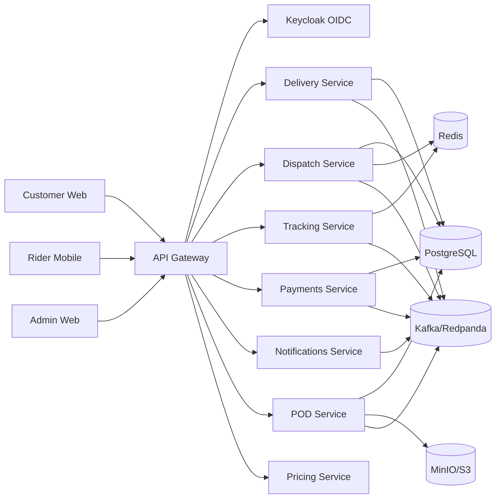
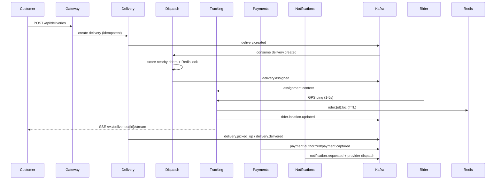

# Scooter Delivery Platform – Modern Architecture (MVP)

## 1) Architecture Blueprint

The platform is split into three client apps and backend microservices behind a single API Gateway.

- **Customer app**: create delivery, estimate fare, pay, live-track rider, chat/call hooks.
- **Rider app**: availability state, offer accept/reject, navigation hooks, GPS ping, POD.
- **Admin app**: rider operations, pricing/zones, dispute/refunds, analytics.

### Core building blocks
- **API Gateway** (`services/api-gateway`): public ingress, JWT auth, RBAC, rate-limit hooks.
- **Identity** (**Keycloak**) with OAuth2/OIDC JWT issuance.
- **Services**: delivery, dispatch, tracking, pricing, payments, notifications, pod.
- **Event backbone**: Kafka/Redpanda topics.
- **Data stores**:
  - PostgreSQL (source of truth for business entities).
  - Redis (cache, locks, last-known rider location).
  - MinIO/S3 (POD photo/object storage).

### Mermaid – system context

### Mermaid – delivery lifecycle + events

## 2) Delivery State Machine (server-enforced)

Allowed transitions:
- `CREATED -> ASSIGNED`
- `ASSIGNED -> PICKED_UP`
- `PICKED_UP -> DELIVERED`
- Optional terminal transitions: `CREATED|ASSIGNED -> CANCELLED`, `ASSIGNED|PICKED_UP -> FAILED`

Invalid transitions return `409 CONFLICT`.

## 3) Topic Contracts (MVP)

- `delivery.created`
- `delivery.assigned`
- `delivery.picked_up`
- `delivery.delivered`
- `rider.location.updated`
- `payment.authorized`
- `payment.captured`
- `payment.refunded`
- `notification.requested`
- `pod.created`

## 4) Reliability + Security Baseline (MVP)

- Idempotency headers for delivery/payment write operations.
- Redis lock/lease in dispatch to avoid double assignment.
- Outbox table pattern recommendation for transactional event publishing.
- Circuit breaker + retries for external providers (payments/SMS/maps).
- Correlation ID propagated from gateway (`X-Correlation-Id`).
- JWT verification in each service (`issuer-uri` from Keycloak).
- RBAC roles: `CUSTOMER`, `RIDER`, `ADMIN`.

## 5) Keycloak Realm Setup (Local)

1. Start compose: `docker compose -f infra/docker-compose.yml up -d keycloak postgres`
2. Open `http://localhost:8081` (`admin/admin` for local dev).
3. Create realm `scooter` (or import `infra/keycloak/realm-export.json`).
4. Create client `scooter-gateway`:
   - Access type: confidential/public depending client type.
   - Valid redirect URIs:
     - `http://localhost:5173/*` (customer)
     - `http://localhost:5174/*` (admin)
     - `http://localhost:8080/*` (gateway callbacks)
5. Create realm roles: `CUSTOMER`, `RIDER`, `ADMIN`.
6. Create users and assign roles.
7. Ensure JWT includes `realm_access.roles` claim.
8. Configure services with:
   - `SPRING_SECURITY_OAUTH2_RESOURCESERVER_JWT_ISSUER_URI=http://keycloak:8080/realms/scooter`

## 6) MVP-first vs Later

### Implemented in this scaffold
- Delivery/Dispatch/Tracking services with REST + Kafka + Redis basics.
- API Gateway route/auth/correlation scaffolding.
- Compose dependencies and local runtime.

### Later enhancements
- Full outbox implementation per service.
- Dynamic zone/pricing service logic.
- Real ETA using map provider.
- Fraud heuristics (GPS spoof, device binding) hardening.
- Admin analytics materialized views + OLAP sink.
